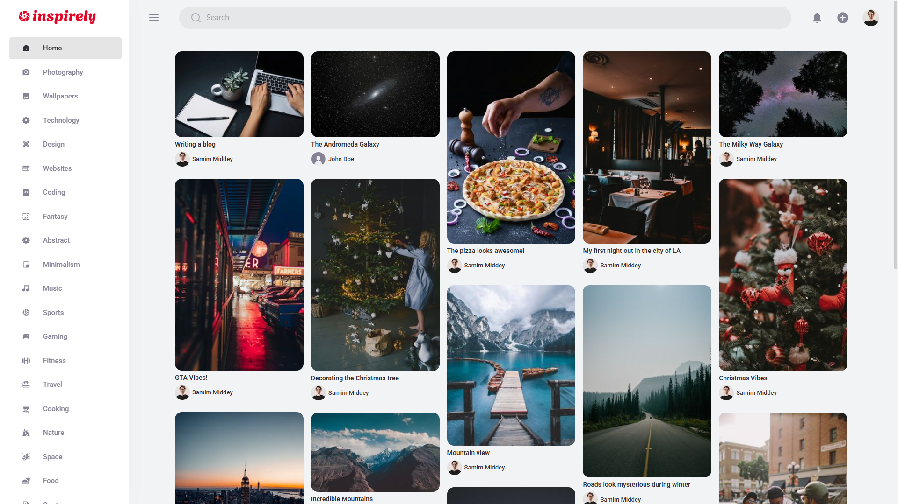

# **INSPIRELY**

Inspirely is a fully fledged modern full-stack social media app built with various modern technologies and it includes some amazing features such as authentication, creating pins, saving pins, the ability to comment on each post and realtime notifications. It is a NextJS app and it uses some incredible built-in NextJS features such as server-side rendering and image optimization. <a href="https://inspirelyhub.vercel.app" target="_blank">Visit</a>

## **ABOUT**

The main motive behind creating this app was to create a platform which is not only aesthetically pleasing, but to also provide a top notch user experience. The app is well optimized and it makes the best usage of best react practices and all the modern technologies that were used. The technologies were chosen based on the requirements.

## **FEATURES**

##### **1. AUTHENTICATION**
   - Authentication with email & password
   - Authentication with Google
   - Authentication with Facebook
   - Ability to update email adress
   - Ability to update password
   - Ability to delete account if signed up with email & password

##### **2. PIN**
   - Create a pin
   - Save a pin
   - Delete your pin
   - Download pins
   - Share pins

##### **3. INFINITE SCROLLING**
##### **4. COMMENT SECTION**
##### **5. SEARCHING ABILITIES**
##### **6. REALTIME NOTIFICATIONS**
##### **7. DARK MODE**
##### **8. FULLY RESPONSIVE**

## **TOOLS & TECHNOLOGIES USED**
- NextJS
- Redux Toolkit
- Material UI
- Firebase
- Sanity
- React Hook Form
- Yup Schema Validation
- Socket IO Client
- React Icons
- React Infinite Scroller
- React Loader Spinner
- Framer Motion
- MomentJS
- NProgress
- Axios
- UUID
